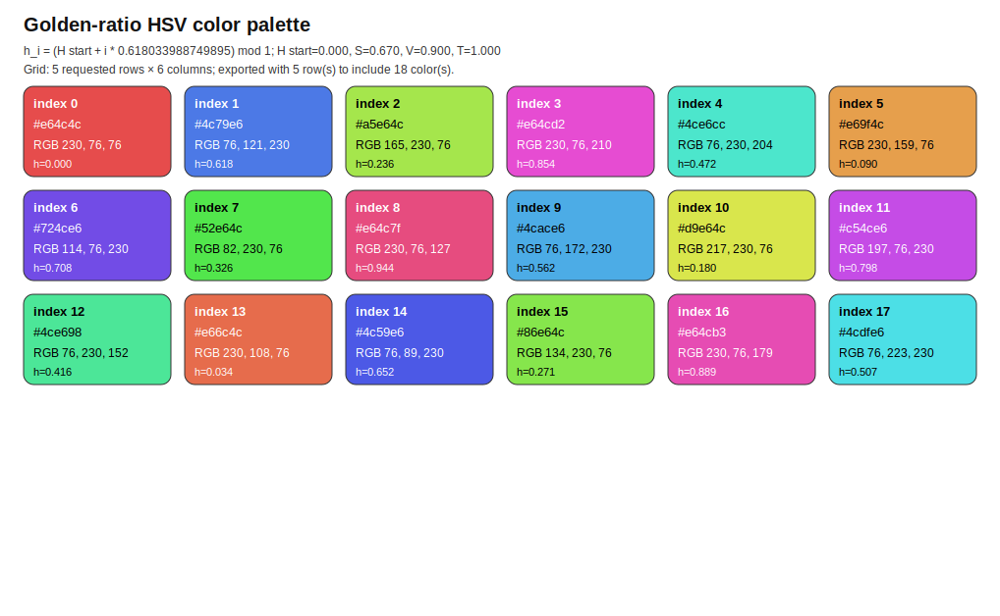
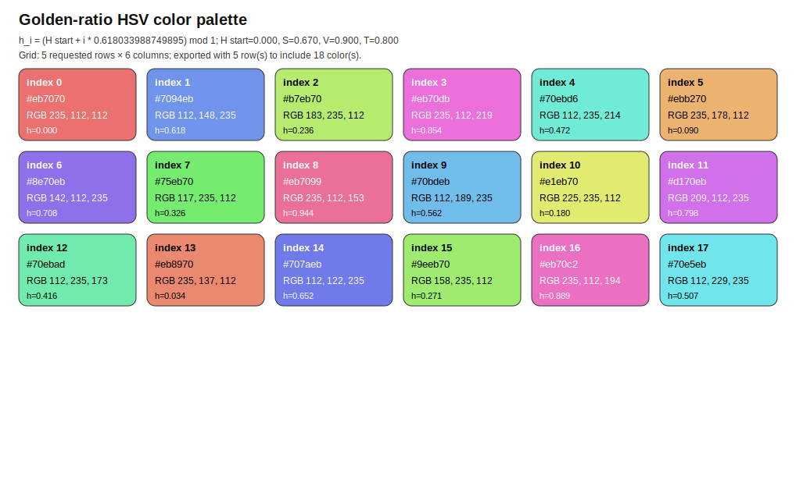
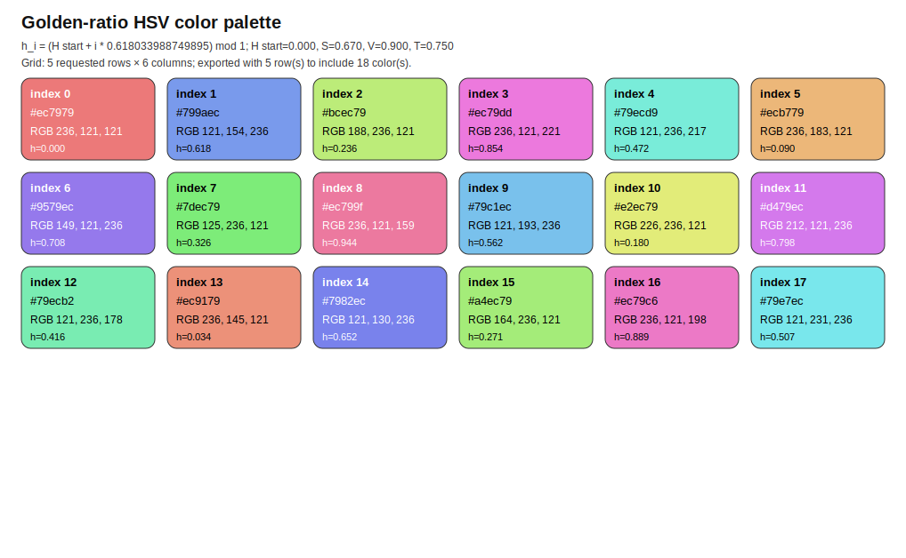
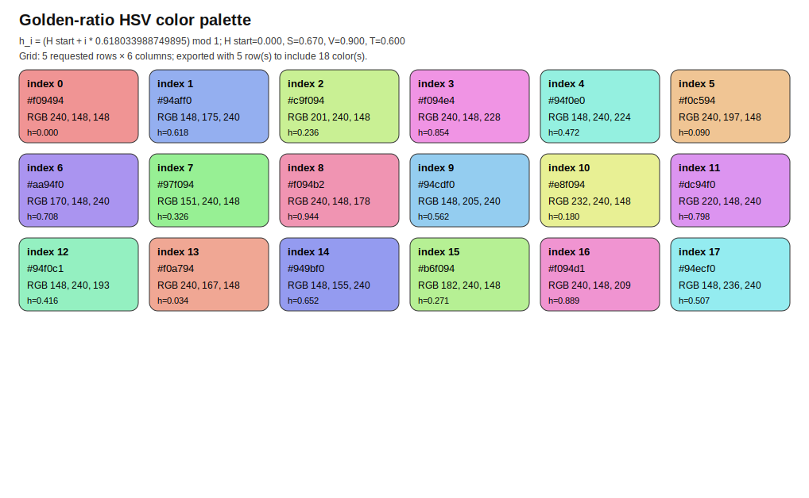
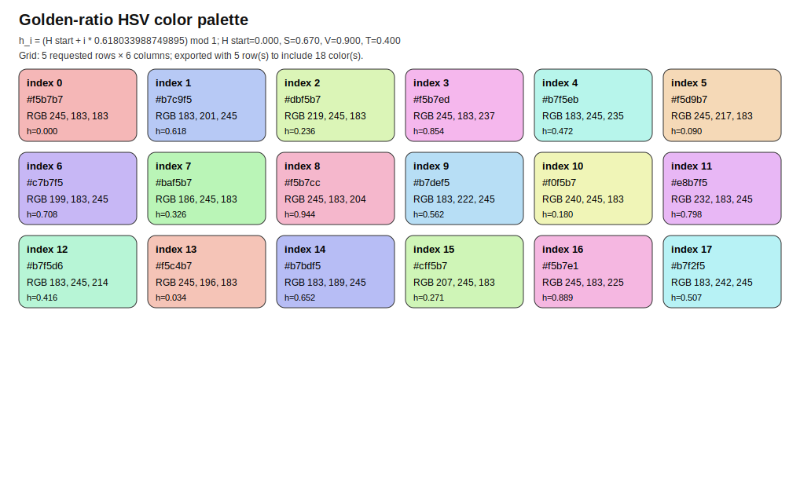
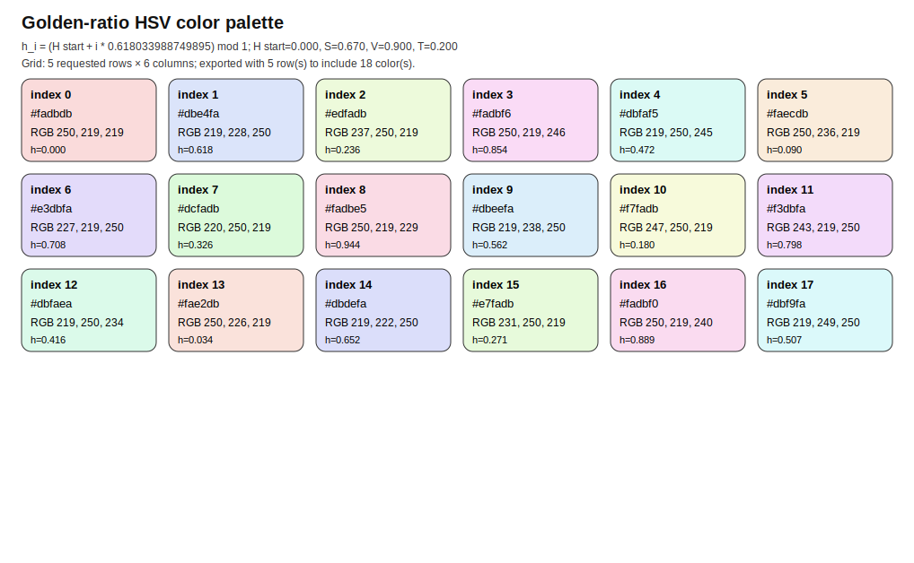
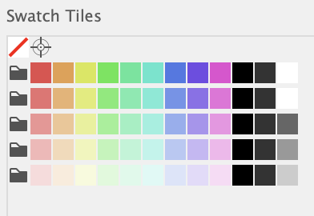
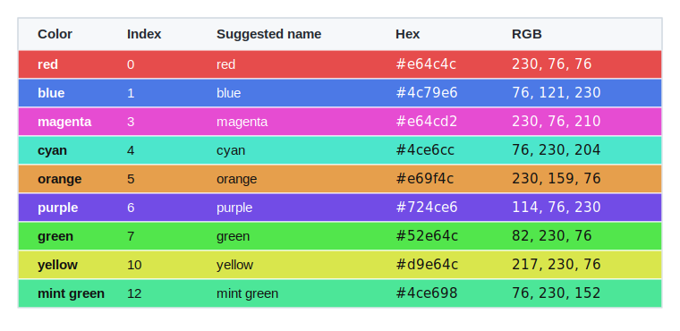

# gr_colors

Golden-ratio HSV color palette generator for consistent Di Liu Lab figures.

`gr_colorsV3_1.py` can be used as a Tkinter GUI or as a command-line exporter. It generates colors by stepping around hue space with the golden-ratio conjugate, then applies optional tinting toward white. The GUI previews the palette, shows a selectable color-index table, and can export CSV or SVG files.

## Files

- `gr_colorsV3_1.py`: color generator GUI and CLI.
- `DiLiuLab-gr_colors-all.ai`: suggested Adobe Illustrator palette for lab figures.
- `example_results/`: example SVG palette exports at several tint levels.
- `assets/illustrator-swatch-groups.png`: example Illustrator swatch groups.
- `assets/gr_colors_icon.png`: optional Tkinter window/task-menu icon.
- `assets/gr_colors_icon.svg`: editable source for the icon.

The script still runs if the icon asset is missing.

## Requirements

- Python 3.9 or newer.
- Tkinter for the GUI. Tkinter is included with many Python installs, including the python.org macOS installer. If Tkinter is unavailable or there is no display, use `--cli`.

No third-party Python packages are required for normal use.

## Run The GUI

```bash
python3 gr_colorsV3_1.py
```

Adjust the number of colors, starting hue, saturation, value/brightness, tint, and preview columns. Use:

- `Copy color table` to copy the aligned table.
- `Save CSV` to export numeric color values.
- `Export SVG` to export a palette preview.

## Run From The Command Line

Print a palette table:

```bash
python3 gr_colorsV3_1.py --cli --number 16 --saturation 0.67 --value 0.90 --tint 1.0
```

Save CSV:

```bash
python3 gr_colorsV3_1.py --cli --number 16 --output palette.csv
```

Save SVG:

```bash
python3 gr_colorsV3_1.py --cli --number 16 --columns 4 --svg-output palette.svg
```

Important parameters:

- `--number`: number of colors to generate.
- `--start-hue`: starting hue in the range 0 to 1.
- `--saturation`: HSV saturation in the range 0 to 1.
- `--value`: HSV value/brightness in the range 0 to 1.
- `--tint`: tint factor, where `1` keeps the original color and `0` gives white.
- `--columns`: number of preview/SVG columns.

## Example Results

The `example_results/` folder includes SVG exports at several tint levels. These examples use the same default hue, saturation, and value settings, while changing only the tint factor.

| Tint level | Preview |
| --- | --- |
| T 100% |  |
| T 80% |  |
| T 75% |  |
| T 60% |  |
| T 40% |  |
| T 20% |  |

## Clone And Pull

Clone downloads a full copy of the GitHub repository to your computer:

```bash
git clone https://github.com/DiLiuLab/gr_colors.git
cd gr_colors
```

Pull updates an existing local copy with newer commits from GitHub:

```bash
git pull
```

Use `git clone` once when you do not have the project yet. Use `git pull` later from inside the project folder when you want the latest version.

## Make The Script Executable

On macOS or Linux, make the Python script directly executable:

```bash
chmod +x gr_colorsV3_1.py
./gr_colorsV3_1.py
```

This uses the script's first line, `#!/usr/bin/env python3`, to find Python.

To make a standalone macOS app, install PyInstaller and bundle the optional Tk window/task-menu icon asset:

```bash
python3 -m pip install pyinstaller
pyinstaller --noconfirm --windowed --name gr_colors \
  --add-data "assets/gr_colors_icon.png:assets" \
  gr_colorsV3_1.py
```

The app will be created under `dist/gr_colors.app`. If the icon asset is not bundled, the app still runs with the default Tkinter icon.

For a native macOS app-bundle icon, convert `assets/gr_colors_icon.svg` or `assets/gr_colors_icon.png` to `.icns` and add `--icon path/to/icon.icns` to the PyInstaller command.

## Adobe Illustrator Palette

I am sharing `DiLiuLab-gr_colors-all.ai` as a suggested color palette for our figures. Please use the nine colors from Artboard #1 as the main lab color set. The colors are provided at several tint levels: T 100%, T 80%, T 60%, T 40%, and T 20%. Please use these colors and their provided tints so that our figures remain visually consistent across projects.

Artboard #2 is provided only as a reference to show the full generated color set.

Example swatch groups in Adobe Illustrator:



To add these colors into Adobe Illustrator:

1. Open the `.ai` file in Illustrator.
2. Go to Artboard #1.
3. For each tint level, select/copy all the color boxes in that tint group.
4. Paste them into your working Illustrator file.
5. With those color boxes selected, open `Window` -> `Swatches`.
6. In the Swatches panel menu, click `New Swatch Group` to create each color group.
7. Create one swatch group per tint level, for example: `T100`, `T80`, `T60`, `T40`, and `T20`.
8. After the swatch groups are created, you can delete the copied color boxes from your figure file.

Suggested color names:

- `0 red`
- `1 blue`
- `3 magenta`
- `4 cyan`
- `5 orange`
- `6 purple`
- `7 green`
- `10 yellow`
- `12 mint green`

T 100% color values:



Text values for copying:

| Index | Suggested name | Hex | RGB |
| --- | --- | --- | --- |
| 0 | red | `#e64c4c` | `230, 76, 76` |
| 1 | blue | `#4c79e6` | `76, 121, 230` |
| 3 | magenta | `#e64cd2` | `230, 76, 210` |
| 4 | cyan | `#4ce6cc` | `76, 230, 204` |
| 5 | orange | `#e69f4c` | `230, 159, 76` |
| 6 | purple | `#724ce6` | `114, 76, 230` |
| 7 | green | `#52e64c` | `82, 230, 76` |
| 10 | yellow | `#d9e64c` | `217, 230, 76` |
| 12 | mint green | `#4ce698` | `76, 230, 152` |

This will help make our figures more consistent across different projects and manuscripts.

## License

MIT License. See `LICENSE`.
